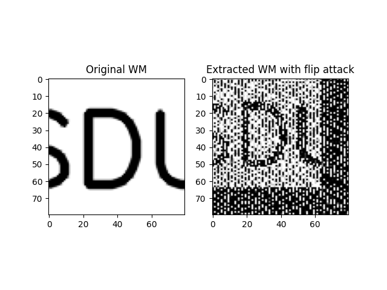

# 基于DCT的数字水印嵌入与提取及鲁棒性测试

本项目实现了一个基于离散余弦变换（DCT）的数字图像水印系统，具备水印的嵌入、提取功能，并支持对翻转、平移、裁剪等攻击方式的鲁棒性测试。

## 一、项目结构

- `lena.png`：原始图像（载体图像）
- `wm.png`：待嵌入的水印图像（建议为黑白图）
- `watermarked.png`：嵌入水印后的图像
- `flipped.png`：对嵌入图像进行翻转攻击后的图像
- `wm_extracted_flip.png`：从翻转攻击后的图像中提取出的水印

## 二、算法原理

### ✅ 水印嵌入原理

1. 将输入图像转为灰度图像。
2. 将水印图像缩放到原图大小的1/8。
3. 使用 OpenCV 的 `cv2.dct` 计算原图的 DCT 系数。
4. 在 DCT 的低频区域添加乘以 `alpha` 权重的水印图像。
5. 使用 `cv2.idct` 进行逆变换生成水印图像。

> 嵌入公式：
>  $$ DCTembedded=DCToriginal+α⋅Watermark$$

### ✅ 水印提取原理

通过对比嵌入图像与原图的 DCT 系数差值提取出水印：

> 提取公式：
> $$ Watermark=\frac{DCT_{attacked} - DCT_{original}}{\alpha}$$

## 三、核心函数说明

### 1. `embed_watermark(image, watermark, alpha=10)`

**功能：** 利用DCT将二值水印嵌入图像的低频系数中。

**参数：**
- `image`：BGR图像（原图）
- `watermark`：灰度图，作为水印图像
- `alpha`：嵌入强度参数，越大嵌入越明显，但失真也越大

**返回：**
- 带有水印的灰度图像

---

### 2. `extract_watermark(watermarked, original, wm_shape, alpha=10)`

**功能：** 从水印图像中提取嵌入的水印。

**参数：**
- `watermarked`：遭受攻击后的图像（灰度）
- `original`：原始图像（灰度）
- `wm_shape`：水印尺寸 (height, width)
- `alpha`：嵌入强度，需与嵌入时一致

**返回：**
- 提取出的水印图像（灰度）

---

### 3. 攻击模拟函数

- `flip(img)`：水平翻转图像
- `shift(img, dx, dy)`：平移图像
- `crop(img, percent)`：裁剪图像百分比区域

## 四、演示流程

```python
# 读取图像
img = cv2.imread("lena.png")
wm = cv2.imread("wm.png", 0)

# 水印嵌入
watermarked = embed_watermark(img, wm)
cv2.imwrite("watermarked.png", watermarked)

# 翻转攻击
attacked_flip = flip(watermarked)
cv2.imwrite("flipped.png", attacked_flip)

# 水印提取
wm_extracted_flip = extract_watermark(attacked_flip, cv2.cvtColor(img, cv2.COLOR_BGR2GRAY), (wm.shape[0], wm.shape[1]))
```

## 五、显示效果

```python
plt.subplot(1, 2, 1)
plt.title("Original Watermark")
plt.imshow(wm, cmap='gray')
plt.subplot(1, 2, 2)
plt.title("Extracted Watermark (Flip Attack)")
plt.imshow(wm_extracted_flip, cmap='gray')
plt.show()
```



## 六、鲁棒性说明

该方法在翻转攻击下能一定程度保留水印信息。在更多攻击（如平移、截取）下可能需要配合DWT、SVD等方法增强鲁棒性。

## 七、依赖库

- `opencv-python`
- `numpy`
- `matplotlib`
